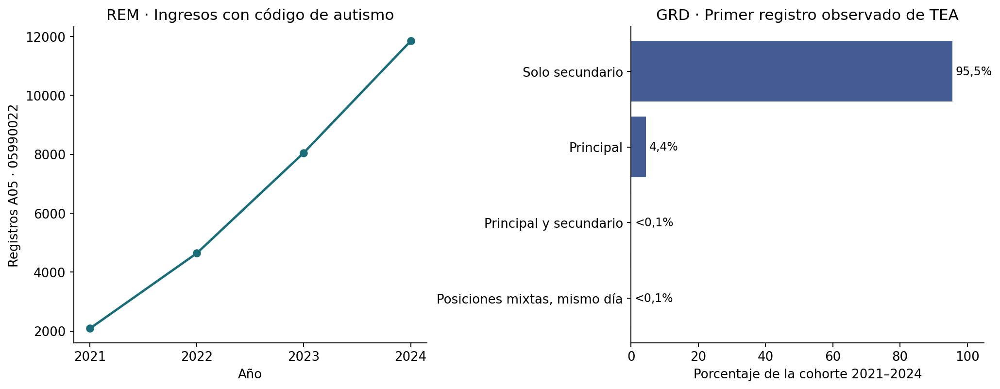

## Alcance y lectura

Se revisaron **5,808,535 registros GRD (2019–2024)** y **40,678,929 filas REM (2017–2024)**. Este informe resume una extracción nueva; la [propuesta de análisis](propuesta-rem-grd.md) detalla el diseño y las ampliaciones pendientes.

**Resultado central:** GRD permite investigar diagnósticos hospitalarios anteriores al primer registro observado de autismo, separando posición principal y secundaria. No identifica por sí solo el primer diagnóstico clínico ni demuestra que los diagnósticos previos fueran diferenciales descartados.

Los resultados longitudinales son exploratorios: enlazan por identificador dentro de 2019–2020 o 2021–2024 y excluyen identificadores inconsistentes. No se cruzan ambos períodos. La cohorte principal usa **F84.0, F84.1, F84.5, F84.8 y F84.9** como definición operacional. La posición principal corresponde operacionalmente a `DIAGNOSTICO1`; la estabilidad del identificador y esta semántica requieren confirmación documental del productor.

## GRD: qué se puede enlazar

No se encontró ningún identificador compartido entre los bloques 2019–2020 y 2021–2024. Entre 2023 y 2024 sí existen coincidencias, pese al cambio de nombre del campo. La concordancia siguiente se calcula solo entre identificadores con nacimiento y sexo comparables y sin contradicciones internas de cada año; no certifica identidad.

| Año inicial | Año final | ID compartidos | Comparables | Concordantes | % concordancia |
| --- | --- | --- | --- | --- | --- |
| 2019 | 2020 | 78320 | 77053 | 75235 | 97,6 |
| 2019 | 2021 | 0 | 0 | 0 | — |
| 2019 | 2022 | 0 | 0 | 0 | — |
| 2019 | 2023 | 0 | 0 | 0 | — |
| 2019 | 2024 | 0 | 0 | 0 | — |
| 2020 | 2021 | 0 | 0 | 0 | — |
| 2020 | 2022 | 0 | 0 | 0 | — |
| 2020 | 2023 | 0 | 0 | 0 | — |
| 2020 | 2024 | 0 | 0 | 0 | — |
| 2021 | 2022 | 91939 | 90816 | 89249 | 98,3 |
| 2021 | 2023 | 72764 | 71984 | 70498 | 97,9 |
| 2021 | 2024 | 65731 | 65076 | 63561 | 97,7 |
| 2022 | 2023 | 112475 | 111194 | 109295 | 98,3 |
| 2022 | 2024 | 85778 | 84887 | 83187 | 98,0 |
| 2023 | 2024 | 127250 | 125770 | 123883 | 98,5 |

## GRD: cohorte y posición del primer registro

La fecha índice es el primer alta observada con la definición seleccionada. Un egreso previo debe finalizar antes del ingreso al episodio índice. No se imputan fechas. Un registro secundario puede corresponder a autismo conocido antes de esa hospitalización.

| Período | Identificadores incluidos | Con egreso previo | % con egreso previo | Con grupo previo de interés | % con grupo previo de interés | Edad mediana al registro |
| --- | --- | --- | --- | --- | --- | --- |
| 2019-2020 | 3029 | 428 | 14,1 | 243 | 8,0 | 9,0 |
| 2021-2024 | 15493 | 2617 | 16,9 | 1230 | 7,9 | 9,4 |

| Período | Posición | Identificadores | % |
| --- | --- | --- | --- |
| 2019-2020 | Principal | 239 | 7,9 |
| 2019-2020 | Principal y secundario | 6 | 0,2 |
| 2019-2020 | Solo secundario | 2784 | 91,9 |
| 2021-2024 | Posiciones mixtas, mismo día | 1 | 0,0 |
| 2021-2024 | Principal | 678 | 4,4 |
| 2021-2024 | Principal y secundario | 15 | 0,1 |
| 2021-2024 | Solo secundario | 14799 | 95,5 |

Los porcentajes describen una cohorte hospitalaria seleccionada, no a todas las personas autistas en Chile. La edad es la edad al ingreso del primer episodio observado, no la edad del diagnóstico clínico. Las personas sin egresos previos quedan incluidas en los denominadores y no se interpretan como personas sin antecedentes clínicos.

### Diagnósticos anteriores de interés, 2021–2024

Se cuenta una vez a cada identificador por grupo, en cualquier posición diagnóstica. Los grupos pueden coexistir y no son diferenciales clínicos confirmados. El denominador de toda la cohorte es **15,493**; el de quienes tienen un egreso previo es **2,617**.

| Grupo | Identificadores | % cohorte | % con egreso previo |
| --- | --- | --- | --- |
| Animo ansiedad estres | 485 | 3,1 | 18,5 |
| Epilepsia | 382 | 2,5 | 14,6 |
| Signos desarrollo habla | 224 | 1,4 | 8,6 |
| Lenguaje aprendizaje desarrollo | 222 | 1,4 | 8,5 |
| Conducta emociones infancia | 152 | 1,0 | 5,8 |
| Discapacidad intelectual | 142 | 0,9 | 5,4 |
| Hiperactividad atencion | 102 | 0,7 | 3,9 |
| Psicosis | 81 | 0,5 | 3,1 |
| Audicion | 75 | 0,5 | 2,9 |

### Último diagnóstico principal anterior, 2021–2024

Se presentan códigos CIE-10 normalizados sin punto. En empates de fecha se conservan los distintos códigos sin imponer un orden. Las tablas completas también incluyen el primer principal hospitalario observado, ventanas de 365/730 días y las secuencias agregadas.

| Código | Identificadores | % con egreso previo |
| --- | --- | --- |
| N47 | 80 | 3,1 |
| G409 | 71 | 2,7 |
| J353 | 55 | 2,1 |
| J209 | 41 | 1,6 |
| J46 | 40 | 1,5 |
| K358 | 40 | 1,5 |
| F322 | 37 | 1,4 |
| J128 | 36 | 1,4 |
| F603 | 29 | 1,1 |
| J129 | 29 | 1,1 |
| Q532 | 28 | 1,1 |
| J121 | 28 | 1,1 |

### Principal de la hospitalización cuando el TEA aparece solo como secundario

Esta tabla describe el motivo principal codificado en el episodio índice. No corresponde a un diagnóstico anterior al autismo.

| Código principal | Identificadores |
| --- | --- |
| N47 | 718 |
| K358 | 445 |
| J353 | 356 |
| G409 | 353 |
| J46 | 344 |
| F322 | 243 |
| K029 | 191 |
| K353 | 179 |
| J121 | 166 |
| A080 | 161 |
| J129 | 143 |
| R568 | 142 |

### De secundario a principal en una hospitalización posterior

La proporción a 365 días restringe el denominador a índices con al menos 365 días calendario hasta el cierre. No presupone seguimiento clínico continuo. Para la transición, el episodio posterior debe ingresar después del alta índice.

| Período | Índice solo secundario | Principal posterior | Con 365 días disponibles | Principal en 365 días | % a 365 días |
| --- | --- | --- | --- | --- | --- |
| 2019-2020 | 2784 | 22 | 1743 | 11 | 0,6 |
| 2021-2024 | 14799 | 137 | 8978 | 67 | 0,7 |

### Sensibilidad de la definición

`autismo_F840`: F84.0. `TEA_operacional`: F84.0/.1/.5/.8/.9. `F84_historico`: categoría F84 y sus subcategorías válidas, incluyendo Rett. Cada definición vuelve a calcular su propia primera fecha; no se suman sus cohortes. La clasificación distingue estas categorías. [CIE-10, NHS](https://classbrowser.nhs.uk/ICD-10-5TH-Edition/vol1/block-f80-f89.htm).

| Período | Definición | Incluidos | Con egreso previo | Con grupo previo de interés |
| --- | --- | --- | --- | --- |
| 2019-2020 | autismo_F840 | 1956 | 234 | 125 |
| 2019-2020 | TEA_operacional | 3029 | 428 | 243 |
| 2019-2020 | F84_historico | 3095 | 433 | 245 |
| 2021-2024 | autismo_F840 | 13025 | 2407 | 1133 |
| 2021-2024 | TEA_operacional | 15493 | 2617 | 1230 |
| 2021-2024 | F84_historico | 15628 | 2637 | 1242 |

### Oportunidad de observación

Los antecedentes solo pueden observarse dentro de cada bloque. Los conteos siguientes separan disponibilidad calendario de evidencia de un contacto hospitalario anterior. Las proporciones anteriores utilizan toda la cohorte; todavía no son los resultados de una cohorte restringida por 365/730 días.

| Período | Incluidos | 365 días calendario | 730 días calendario | Contacto ≥365 días antes | Contacto ≥730 días antes |
| --- | --- | --- | --- | --- | --- |
| 2019-2020 | 3029 | 1102 | 0 | 73 | 0 |
| 2021-2024 | 15493 | 13529 | 10567 | 1501 | 742 |

### Calidad y exclusiones

El universo de esta tabla son los identificadores con F84 histórico antes de las exclusiones. Las causas pueden solaparse. Los registros sin identificador se cuantifican, pero no pueden entrar en una trayectoria. Las tablas anuales de posiciones se limitan a registros con identificador y deduplicación exacta; no son un censo de todas las hospitalizaciones F84.

| Período | ID F84 iniciales | Registros F84 sin ID | Registros recuperados | Duplicados retirados | ID inconsistentes/incompletos | ID con episodio ambiguo | Registros con fechas inválidas |
| --- | --- | --- | --- | --- | --- | --- | --- |
| 2019-2020 | 3152 | 4 | 6591 | 2 | 50 | 8 | 0 |
| 2021-2024 | 15762 | 6 | 31464 | 0 | 130 | 2 | 4 |

## REM: extracción corregida

El catálogo anual se extrae de los diccionarios originales. Para A05, `Col01` es total, `Col02` hombres, `Col03` mujeres y `Col04–37` son 17 grupos de edad en pares por sexo. Para las secciones A03 revisadas, el total requiere **`Col01 + Col02`**. Las celdas faltantes se conservan como faltantes; no se convierten automáticamente a cero.

### Ingresos al programa con código de autismo

Estos son registros de ingresos A05, no incidencia de autismo ni personas únicas nacionales. Se muestra el período con código específico `05990022`; el TGD genérico de 2017–2020 se mantiene separado. Son sumas de valores observados: en 2024 una de las 5.020 filas de este código carece de total, por lo que 11.842 no acredita un total completo. No se imputó el valor faltante.

| Año | Ingresos | Hombres | Mujeres | % mujeres | Establecimientos con registros | Meses presentes |
| --- | --- | --- | --- | --- | --- | --- |
| 2021 | 2085 | 1624 | 461,0 | 22,1 | 449 | 12 |
| 2022 | 4640 | 3465 | 1.175,0 | 25,3 | 658 | 12 |
| 2023 | 8049 | 5734 | 2.315,0 | 28,8 | 920 | 12 |
| 2024 | 11842 | 8164 | 3.678,0 | 31,1 | 1070 | 12 |

### Controles de calidad REM

Se revisan claves repetidas, totales por sexo y por edad en filas con todas las celdas necesarias observadas. Un mes presente en el agregado no implica cobertura completa de todos los establecimientos. Las seis filas idénticas seleccionadas de 2024 se deduplicaron. Las discrepancias residuales se conservan y se informan; no se corrigieron las fuentes.

| Año | Filas seleccionadas | Duplicadas retiradas | Comparables por sexo | Discrepancias por sexo | Comparables por edad | Discrepancias por edad |
| --- | --- | --- | --- | --- | --- | --- |
| 2017 | 2343 | 0 | 2343 | 0 | 355 | 0 |
| 2018 | 2753 | 0 | 2753 | 0 | 428 | 1 |
| 2019 | 9639 | 0 | 3177 | 0 | 480 | 0 |
| 2020 | 6512 | 0 | 1857 | 1 | 357 | 0 |
| 2021 | 12428 | 0 | 4068 | 0 | 910 | 0 |
| 2022 | 17755 | 0 | 5938 | 0 | 1360 | 0 |
| 2023 | 33710 | 0 | 8114 | 0 | 1968 | 0 |
| 2024 | 54278 | 6 | 9594 | 0 | 2883 | 0 |

### Extensión recomendada

Priorizar: (1) tendencias mensuales A05 por sexo/edad y establecimientos informantes; (2) indicadores de tamizaje con numerador y denominador de la misma etapa, distinguiendo 2019–2022 de 2023–2024; (3) ingresos a rehabilitación A28, diferenciando secciones. A28 no debe etiquetarse automáticamente como consultas. No hay enlace individual REM–GRD en estas bases.

No se calculan tasas de positividad ni incidencia a partir de fórmulas sin denominador validado. La [propuesta completa](propuesta-rem-grd.md) establece los modelos y los controles necesarios antes de extender a 2025–2026 o reutilizar las tasas geográficas históricas.

## Reproducibilidad

Las entradas son los CSV canónicos externos. Los resultados agregados están en `output_files/consolidacion/`. Se conserva el inventario de tamaño, fecha de modificación y número de registros, además del catálogo con archivo, hoja y fila de cada código REM. Los manifiestos fuente externos contienen los hashes de los canónicos. Ninguna tabla nueva exporta identificadores o historias individuales.

Los scripts de auditoría y extracción están en `scripts/`; las versiones utilizadas se registran en `requirements-analysis.txt`. El [README](../README.md) contiene los comandos de reproducción. Este documento fue generado con las tablas derivadas y no ejecuta de nuevo la lectura de microdatos. Los informes históricos se conservan, pero requieren la revisión metodológica descrita.
